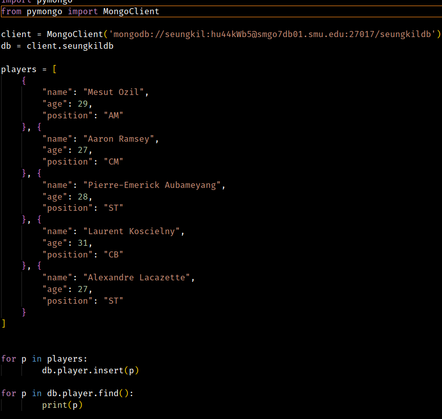
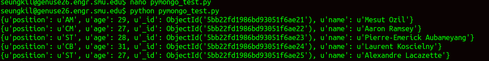

# Quest 6. MongoDB

__SEUNGKI LEE__  

## Part A. Screen Shot

__CODE__



__Genuse DB Call__



## Part B. MongoDB Exploration Handout

__SEUNGKI LEE__  

```
Category: mongoimport
Action: Load CSV file into mongo
```

## Basic Import
```python
mongoimport -d <db_name> -c <collection_name> --file <file_name.extension>
```
you could be more explicit
```python
mongoimport --db <db_name> --collection <collection_name> --file <file_name.extension>
```
or change the order around, as long as it is not `--file` flag
```python
# Order of flags does not matter except --file flag
mongoimport -c <collection_name> -d <db_name> --file <file_name.extension>
```

## Merging DB as you import
consider following document

```json
{
	"_id":  ObjectId("580100f4da893943d393e909")
	"name": "Jake Carlson",
	"major": "Computer Science"
}
```
Now, let's assume that there is another document in the same file

```json
{
	"_id": 	ObjectId("580100f4da893943d393e909")
	"email": "jcarlson@ballin'.com",
	"hobby": ["drinking", "ballin'", "shooting nail guns at people"]
}
```
mongoimport has some very cool feature to not only import the documents, but merge the documents with the same ObjectId.
```json
mongoimport -c smart -d people --mode merge --file people_SMU_2018.json
```
This command will give you
```json
{
	"_id":  ObjectId("580100f4da893943d393e909")
	"name": "Jake Carlson",
	"major": "Computer Science",
	"email": "jcarlson@ballin.com",
	"hobby": [
    	"drinking", 
    	"ballin'", 
    	"shooting nail guns at people"
    	]
}
```

## Importing CSV
Let's assume we have csv data
```python
# name     | gender | age | first language | is engaged?
SeungKi Lee,  M,      25,   Korean,          F
Chi Tran,     M,      23,   Vietnamese,      T
Jake Carlson, M,      22,   C++,             F?
```

We could just load the data, but this will most likely load everything as string. That can create a problem when we want to work with the data later on. So we can specify the type of the field as we import.

```python
mongoimport -d people -c info --type csv --columnsHaveTypes -f "name.string(), gender.string(), age.int32(), language.string(), is_engaged.boolean()" --file ~/people_file_2018.csv
```

This will force the type of each field, making it easier to work with!